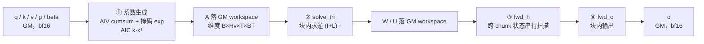
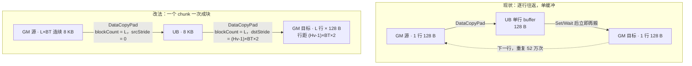
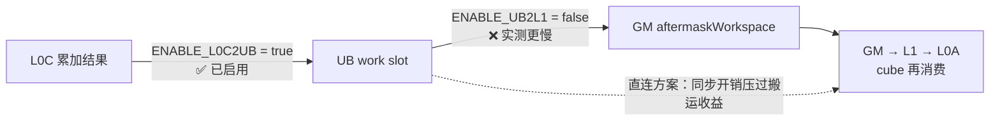

# GDN 现网 AscendC 实现：数据搬运优化空间分析

> 对象：`fla/ops/ascendc/gdn`（A2/A3 走 `arch22`，A5 走 `arch35`，两套代码隔离维护）
> 口径：搬运量与迭代次数按 `B=1`、`Hv=16`、`T=32768`、`BT=64` 估算；`A` 矩阵为 `[B,Hv,T,BT]` bf16 = 64 MB。所有收益都是**静态估算**，落地前必须实测。

---

## 0. 一句话结论

**主体已经优化得很到位，剩下的空间几乎全在"边界路径"上。**

已经做对的部分：主循环全部 PING-PONG 双缓冲、跨核用 `CrossCoreSetFlag`/`CrossCoreWaitFlag` 做流式交接（而不是 `SyncAll`）、arch35 已经上了寄存器级融合、`L0C→UB` 直连已启用、全仓 `SetAtomicAdd` 为 0。

剩下三处值得动：

| 优先级 | 位置 | 问题 | 性质 |
| --- | --- | --- | --- |
| **P0** | `arch22` 的 TND 布局 staging | 逐行 GM→UB→GM，单缓冲 + 每行 4 个同步 | 量级最大，纯搬运 |
| **P1** | arch35 fwd_o 的 `ENABLE_UB2L1` | 已实现、已实测，**比走 GM 更慢** | 说明下一步该减交接**次数**而非单次长度 |
| **P2** | tail chunk 的手写 GEMV / 单元素 `exp` 往返 | 标量读 + 每个 k 一次同步 | 频次低，但写法可以整体消掉 |

**再看"非搬运维度还有没有稳妥收益"（§7）**：基本没有。

- 常规三板斧（双缓冲 / 跨核流式交接 / 寄存器融合）都打过了；
- 唯一被寄予希望的「vector→cube 直连」**已实测否掉**（§4），所以那条路上"稳妥可拿"是 0；
- 非搬运维度只剩一个**结构性天花板**——H 阶段的并行宽度就是 head 数（§7.1），它和上一份文档里 CANN 融合算子的 F1 是同一个问题，**要重构、不算稳妥**；
- 其余是"必须扫参"的参数和"零风险但收益≈0"的清理（§7.2 / §7.4）。

**不存在「低风险 + 确定收益」的第三类优化。** 三条路径的理论收益量化见 §6。

---

## 1. 整条通路

融合前向 kernel 内部等价于公开算子链的四个阶段，每段之间都经由 GM workspace 交接：



两个关键事实：

1. **AIV 产出、AIC 消费**是这张图的主旋律。vector 算完的结果必须先落 GM，cube 才能从 GM 读进 L1 —— 这是硬件约束（cube 的操作数只能来自 GM/L1），不是实现偷懒。
2. **布局转换全部收在算子内部**：外部只给 `BNSD/NTD/BSND/TND`，不需要调用方先转置。代价是内部要付一次"整理成连续"的钱——这笔钱就是下面 P0。

---

## 2. 已经做对的部分（先确认，避免重复优化）

| 做法 | 证据 |
| --- | --- |
| 主循环 PING-PONG 双缓冲，事件 id 按 stream 分组，出口统一 drain | `PING_PONG_STAGES`、`pingpongFlag`、`DrainVectorPipelineEvents`（`gdn_fwd_h_kernel.hpp:512-545`） |
| 跨核流式交接而非全局 barrier | `CrossCoreSetFlag<0x2, PIPE_FIX>(cubeBlockScheduler.cube3Done[streamId])` |
| arch35 寄存器级融合，彻底不碰 UB | `VF_CALL` 45 处、`MicroAPI` 33 处、`RegTensor` 1133 处；`causal_conv1d_regbase.h` 的 `GetValue` 为 **0** 次 |
| cube→vector 跳过 GM（L0C 直写 UB） | `ENABLE_L0C2UB = true`（`gdn_fwd_o_kernel.hpp:95`） |
| 用显式累加换确定性 | 全目录 `SetAtomicAdd` / `AtomicAdd` = **0** |

**结论**：常规的"双缓冲 / 加大搬运块 / 减少 GM 往返"三板斧，主循环已经都打过了。能找的只剩下没有覆盖到的分支。

---

## 3. P0：TND 布局 staging 是逐行单缓冲（最值得做）

### 3.1 现状

位置：`chunk_gated_delta_rule_fwd/.../internal/arch22/operators/chunk_kkt_solve_tri/op_kernel/solve_layout_staging.h`
触发条件：`abc.BT == 64 && abc.isVarlen != 0`（arch22 / A2、A3 / chunk 64 / 变长），即**打包序列服务场景**。
调用点：`chunk_gated_delta_rule_fwd_arch22.cpp:285-301`，**求解前后各一次**，中间夹着 4 次 `SyncAll<false>`。

```cpp
for (int64_t row = vectorIndex; row < rowCount; row += vectorCount) {   // rowCount = B*Hv*T
    AscendC::DataCopyPad(rowLocal, sourceGm[sourceOffset], rowParams, padParams);
    AscendC::SetFlag<AscendC::HardEvent::MTE2_MTE3>(mte2ToMte3);
    AscendC::WaitFlag<AscendC::HardEvent::MTE2_MTE3>(mte2ToMte3);   // ← 立即等
    AscendC::DataCopyPad(destinationGm[destinationOffset], rowLocal, rowParams);
    AscendC::SetFlag<AscendC::HardEvent::MTE3_MTE2>(mte3ToMte2);
    AscendC::WaitFlag<AscendC::HardEvent::MTE3_MTE2>(mte3ToMte2);   // ← 立即等
}
```

三个问题叠在一起：

- **单缓冲**：只有一个 `rowBuffer`，`SetFlag` 紧跟 `WaitFlag`，MTE2 和 MTE3 完全没有重叠；
- **粒度太小**：每行只有 `BT=64` 个元素 = **128 B**，远低于搬运的启动开销门槛；
- **同步次数**：每行 4 个跨 pipe flag。

### 3.2 代价估算

`rowCount = B*Hv*T = 1 × 16 × 32768 = 524,288` 行：

| 指标 | 数值 |
| --- | --- |
| 单次 staging 的 `DataCopyPad` 调用 | 2 × 524,288 ≈ **105 万次** |
| 单次 staging 的跨 pipe 同步 | 4 × 524,288 ≈ **210 万次** |
| 搬运量（进 + 出） | 64 MB + 64 MB = **128 MB** |
| 前后两次 staging 合计 | **256 MB** 流量 + **420 万次**同步 |

对照一下：solve 本身只需要读一次 `A`（64 MB）。**也就是说，为了把 `A` 摆成求解器喜欢的布局，搬运开销是它服务的那次读取的 4 倍。**

### 3.3 改法：按 `(batch, head, chunk)` 成块搬，而不是按行

转置的本质是 `(b,h,t,c) → (b,t,h,c)`。固定 `(b,h)` 后，源是 `[T, BT]` 的连续矩阵，目标行距是 `Hv*BT`。所以完全可以**一次搬一个 `[L, BT]` 的块**（`L` = 该 chunk 的有效 token 数）：



具体做法：

- 把 `rowParams{1, rowBytes, 0, 0, 0}` 换成 `{blockCount = chunkLen, blockLen = BT*sizeof(T), srcStride = 0, dstStride = (Hv-1)*BT*sizeof(T)}`；
- 迭代次数从 `B*Hv*T` 降到 `B*Hv*(T/BT)`，即 **16 × 512 = 8,192 次**，比现在少 **64 倍**；
- UB 需求按块算（`BT*BT*sizeof(T)` = 8 KB，双缓冲 16 KB），完全放得下；
- **尾块不用特判**：`L` 直接取该 chunk 的实际长度即可，源侧每行仍是补齐后的 `BT` 个元素。

更进一步，`dstStride` 已经支持，"成块搬"这条路是通的；如果想要更极限，可以一次搬多个 head（`srcStride` 取 `T*BT`、`dstStride` 取 0 的分段组合）——但先做上面这一步就够了。

### 3.4 预期

按 `T=32768` 估算：**单次 staging** 的搬运调用数从约 105 万降到 1.6 万，同步次数从约 210 万降到 3.3 万（两次 staging 合计约 6.6 万）；流量不变（还是 256 MB），但**从"每 128 B 停一次"变成"每 8 KB 才停一次"**。真实收益取决于搬运启动开销在总时间里的占比——而这个占比恰恰是**可以通过 P0 自己来测量**的：改完前后看这段的 timeline 即可。**换算成绝对时间的估算见 §6.2（约 2.2 至 8.6 ms）。**

> 这是一块独立的、不依赖其它改动的优化，风险低（纯地址计算 + 两个参数），建议**第一个做**。

---

## 4. P1：vector→cube 直连已经试过，而且输了

这条正好回答"vector 转 cube 还能不能省"——**代码里已经有两个开关，一个开一个关，并附了实测结论**：

```cpp
// ENABLE_L0C2UB: Cube2/Cube3 V128 output goes L0C -> UB slot directly (skip GM workspace).
static constexpr bool ENABLE_L0C2UB = true;
// ENABLE_UB2L1: Vec1 aftermask goes UB -> L1 directly (skip GM aftermaskWorkspace).
static constexpr bool ENABLE_UB2L1 = false; // accurate but slower (1.02x vs 1.09x l0c2ub-only):
                                            // sync overhead exceeds the GM-roundtrip saving
```

位置：`chunk_fwd_o/op_kernel/arch35/gemm/kernel/gdn_fwd_o_kernel.hpp:93-97`

| 通路 | 状态 | 结果 |
| --- | --- | --- |
| cube → vector（`L0C → UB`，跳过 GM） | **启用** | 有效 |
| vector → cube（`UB → L1`，跳过 GM workspace） | **关闭** | 实测 1.02x vs 1.09x，**更慢** |



**这条结论比省下来的那点搬运量重要得多**：它说明在当前实现里，**跨核同步开销 > GM 往返开销**。所以后续方向不该是"让单次搬运更短或更直"，而应该是：

- **减少交接次数**：把多次小交接合并成一次（同一批数据的两轮 cube 消费合并到一次 flag 里）；
- **把搬运藏进已有的等待里**：既然 cube 无论如何都要等 flag，就让 GM 往返和这次等待重叠（现在 `UB→L1` 的直连反而多了一次反向 drain，见 `:499-502` 的注释）。

顺带一提，`UB→L1` 的代码**保留在仓库里**（`if constexpr (ENABLE_UB2L1)` 分支完整），这对后续返工是好事。

---

## 5. P2：标量↔向量的单元素往返

### 5.1 单个 `exp` 绕了一整圈 UB（arch22 默认路径）

位置：`.../internal/arch22/operators/chunk_gated_delta_rule_fwd_h/op_kernel/epilogue/block/block_epilogue_gdn_fwdh_update.hpp:202-225`
（`scalarGated` 的默认值就是 `true`，见同目录 `gdn_fwd_h_kernel.hpp:64`）

```cpp
GElementInput gLastVal = gInputThisSubBlock.GetValue(chunkSize-1);  // GM 标量读
glastUbTensor.SetValue(0, gLastFloat);                             // 标量 → UB
AscendC::SetFlag<AscendC::HardEvent::S_V>(...);  WaitFlag(...);     // 同步 1
AscendC::Muls(glastUbTensor, glastUbTensor, LN2, 1);
AscendC::PipeBarrier<PIPE_V>();
AscendC::Exp(glastUbTensor, glastUbTensor, 1);                     // 算 1 个元素
AscendC::SetFlag<AscendC::HardEvent::V_S>(...);  WaitFlag(...);     // 同步 2
muls = glastUbTensor.GetValue(0);                                  // UB → 标量
```

为了对**一个标量**求 `exp`，付出了：1 次 GM 标量读 + 3 个 vector 指令（含 1 个 barrier）+ 2 组 `S_V`/`V_S` 同步。

改法（任选）：

- 这个标量本来就在标量单元里，**直接在标量侧算**，不要绕 UB；
- 或者**把它折进后面那次本来就存在的向量乘**：`glastUbTensor` 只有 1 个有效值，与其算出标量再 `Muls`，不如 `Duplicate` 成整行后与 `gkBroadcastUbTensor` 直接 `Mul`——多 1 个向量指令，省掉 2 组同步。

频次：每个 `(chunk, head)` 一次，`512 × 16 = 8192` 次，属"小而确定"的浪费。

### 5.2 tail chunk 的手写 GEMV（`blockTokens < 16`）

位置：`.../arch22/operators/chunk_gated_delta_rule_fwd_h/op_kernel/gemm/kernel/gdn_fwd_h_kernel.hpp:379-422`（`ComputeTailVWorkspace`）、`:425-475`（`ComputeTailHWorkspace`）
触发条件：`tailVectorPath = vec1Offsets.blockTokens < 16`（`:805`、`:838`），即**序列最后一个不满 16 个 token 的 chunk**。

内层循环同时对三件事不利：

```cpp
for (uint32_t kIdx = 0; kIdx < kHeadDim; ++kIdx) {
    WaitFlag<MTE2_V>(EVENT_ID7);
    DataCopy(inputUb, gmH[... + kIdx * vHeadDim], offsets.vBlockDim);   // 每 k 搬一行
    SetFlag<MTE2_V>(EVENT_ID7); WaitFlag<MTE2_V>(EVENT_ID7);
    Cast(floatUb, inputUb, CAST_NONE, offsets.vBlockDim);
    float weight = weightFloatUb.GetValue(kIdx);                        // UB 标量读
    SetFlag<S_V>(EVENT_ID6); WaitFlag<S_V>(EVENT_ID6);                  // scalar→vector 同步
    Muls(...); PipeBarrier<PIPE_V>(); Add(...); PipeBarrier<PIPE_V>();
}
```

**每个 `kIdx`（最坏 128 次）就要一次 GM 小搬 + 一个标量读 + 一组 `S_V` 同步 + 2 个 `PipeBarrier`。**

改法：这是 `accum[n] = Σ_k w[k] * h[k,n]` 的秩-1 累加，向量侧可以整体消掉循环——一次把 `[kHeadDim, vBlockDim]` 搬进 UB，把 `w` 广播成同形，一次 `Mul` + 一次按行归约（`WholeReduceSum`）即可；或者直接交给 cube 做 `w @ h`。

**注意频次**：它只在 `blockTokens < 16` 时走。常规长序列下每个序列只有 1 次，量级很小；但如果业务**以大量短序列为主**（打包式 varlen），这条就会从"尾部特例"变成热路径，那时优先级要提到 P0。这一点建议先用实际业务的序列长度分布确认。

### 5.3 其它零散项（记录，暂不建议动）

- `chunk_bwd_dqkwg_vector.h:945`、`:1144`：`for(h)` 循环内搬 **4 字节**（`{1, sizeof(float), 0, 0}`），前后各 2 个同步——典型的"用 MTE + 同步换一个标量"，但同样是小频次。
- `gdn_preprocess/causal_conv1d/op_kernel/causal_conv1d.h:305-359`（`LoadWeightAndBias`）：按 `(seq, channel block)` 重新搬权重并重 `Cast`。**实际量很小**（`Nseq × dim × width × 2B`，量级只有 KB），不值得改——容易看着可疑但收益为零，列在这里是为了避免下次有人重复分析。
- `arch22` 与 `arch35` 存在大量同名不同内容的重复文件（`gdn_fwd_h_kernel.hpp`、`block_epilogue_gdn_fwdo_*.hpp`、`solve_tri_cube.h` 等）。这是**维护成本**问题不是性能问题，但会导致"改了一边忘了另一边"。

---

## 6. P0–P2 的理论收益

> 口径同前：`B=1`、`Hv=16`、`T=32768`、`BT=64`、24 AIC。所有数字都是**静态估算**，用途是判断"值不值得做"，不替代实测。

### 6.1 统一的时间模型

这三处都是**零重叠的串行搬运算术**（`SetFlag` 紧跟同 id `WaitFlag`、中间没有别的指令），所以耗时可以写成：

$$T = T_{\text{bw}} + N_{\text{iter}} \cdot L_{\text{row}}$$

其中 $T_{\text{bw}}$ 是纯带宽时间（改法**不会**减少它，因为流量不变）， $N_{\text{iter}}$ 是迭代次数， $L_{\text{row}}$ 是"单次迭代的启动 + 握手"延迟。**收益全部来自第二项**——所以判据不是「省了多少流量」，而是「迭代次数降了几倍」。

### 6.2 P0：收益来自 64 倍的迭代压缩

现状（单次 staging， $N_{\text{row}} = B \cdot H_v \cdot T = 524288$ 行，每行 2 次搬运 + 2 对 flag）：

| 量 | 现状 | 改后（按 chunk 成块） | 倍数 |
| --- | --- | --- | --- |
| 迭代次数 | 524,288 | $B \cdot H_v \cdot (T/B_T) = 8192$ | **64×** |
| 搬运调用（单次 staging） | 1.05 M | 16,384 | 64× |
| flag 数（单次 staging） | 2.10 M | 32,768 | 64× |
| 流量 | 128 MB | 128 MB | 1× |

单核口径（24 核均分、两次 staging 合计）：行数 $2 \times 524288 / 24 \approx 43690$。

$$T_{\text{P0}} \approx \frac{256 \text{MB}}{1.6 \text{TB/s}} + 43690 \cdot L_{\text{row}} \approx 0.16 \text{ms} + 43690 \cdot L_{\text{row}}$$

$L_{\text{row}}$ 取 $50 \sim 200$ ns（128 B 的搬运 + 两对跨 pipe flag 往返，且完全无重叠）：

| $L_{\text{row}}$ | 单核 staging 串行耗时 | 改后（÷64） | 可回收 |
| --- | --- | --- | --- |
| 50 ns | 2.2 ms | 34 μs | **2.2 ms** |
| 100 ns | 4.4 ms | 69 μs | **4.3 ms** |
| 200 ns | 8.7 ms | 136 μs | **8.6 ms** |

注意这笔账的性质：这部分时间目前**100% 是附加在关键路径上的净开销**——每行零重叠，和别的 pipe 一点没搭上；而它服务的那次 solve 读入只有 64 MB（≈ 40 μs 带宽）。**搬运开销是其服务对象带宽开销的 50 至 200 倍。**

收益的上下界：

- **上界** = 整段近似消失（约 2.2 至 8.6 ms），对应"这段完全被 issue / sync 主导"；
- **下界** = 0，对应"这段时序上已被别的核盖住"或 $L_{\text{row}}$ 远小于上表假设。

我倾向偏上界，理由有两条：**128 B 远低于搬运效率的粒度门槛**，且**这段完全没有与计算重叠**。但"它到底占多少"本文不猜——改完之后 timeline 上一眼可见（见 §8）。

**顺带一个中间档**：如果不想碰地址计算，**只加一个 ping-pong buffer**（保持逐行粒度）就能让 MTE2 与 MTE3 重叠、把 $L_{\text{row}}$ 折掉约一半，即 **1.1 至 4.3 ms**。这是"改十几行拿一半"的版本，适合当第一步。

### 6.3 P1：收益已经是 0

这条不需要建模，代码里就是一组对照实验：

| 配置 | 加速比 | 折算成时间 |
| --- | --- | --- |
| 只开 `L0C2UB`（**现网**） | 1.09x | −8.3% |
| 再开 `UB2L1` | 1.02x | −2.0% |

所以：

- **「让 vector→cube 直连」这条路的理论收益 = 0**，现网配置已经吃到了它的全部红利（−8.3%）；
- 再往前开一步 `UB2L1` 反而**吐回去 6.4 个百分点**——这就是"多引入的跨核同步 > 省下的 GM 往返"的净差额，**是实测出来的，不是估算**。

残余空间只剩"减少交接次数"这一半，理论上限就是那 6.4 个百分点，而下限是 0（同步侧的硬下限是"每轮至少一次交接"）。**稳妥可拿：0。** 写进文档的目的是**阻止有人再去做一遍 `UB2L1`**——已经有人做过了，而且输了。

### 6.4 P2：小，且完全由业务形态决定

**5.1 的单元素 `exp`**：频次 = `chunk 数 × head 数` = 512 × 16 = 8192，但落在 16 个活跃核上、且串在关键路径里，按单核算 = 512 次。每次约 1 次 GM 标量读 + 3 个向量指令 + 2 组同步，估 280 至 380 ns：

$$T_{\text{exp}} \approx 512 \times 0.3 \mu\text{s} \approx 0.15 \text{ms（单核、串行）}$$

**改法收益 ≈ 0.15 ms**，相对整个 H 阶段是百分之几的量级。**可以做，但别指望它。**

**5.2 的 tail GEMV**：单次（一个 tail chunk × 一个 head）成本 ≈ $k_{\text{HeadDim}}$ 次迭代 × 约 300 ns = $128 \times 0.3 \mu\text{s} \approx 38 \mu\text{s}$。

总线程数 = **序列数 × $H_v$**（每条序列每个 value head 各一次），所以：

$$T_{\text{tail}} \approx \frac{S \cdot H_v \cdot 38 \mu\text{s}}{\text{coreNum}}$$

| 业务形态 | $S \cdot H_v$ | 单核分摊 | 判断 |
| --- | --- | --- | --- |
| 单条长序列（`B=1`， $H_v=16$） | 16 | ≈ 25 μs | **可忽略** |
| 100 条短序列打包 | 1,600 | ≈ 2.5 ms | 值得做 |
| 1000 条短序列打包 | 16,000 | ≈ 25 ms | **可能是主瓶颈** |

**这条的收益从"可以忽略"一路横跨到"可能是主瓶颈"，分岔点就是序列长度分布。** 所以 §8 里把它标为"先确认业务形态再决定优先级"。

---

## 7. 非搬运维度：还有没有"稳妥"的优化点？

### 7.0 直接回答

**基本没有。** 分四档：

| 档位 | 内容 | 稳妥吗 |
| --- | --- | --- |
| **已实测否掉** | vector→cube 直连（`UB2L1`，§4） | 不是"没做"，是**做了、输了** |
| **结构性机会，但要重构 + 实测** | H 阶段并行宽度 = `B·Hv`（§7.1） | 否 |
| **调参型，有明确 trade-off** | `HEADS_PER_TASK`、chunk size（§7.2） | 能拿，但方向不唯一 |
| **零风险但收益≈0** | 无用入参、废弃 workspace、UB 空洞（§7.4） | 稳妥，但不加速 |

一句话：**"改了就赚"的项，搬运维度只剩 P0，以及 P2 的 tail 路径（且依赖业务形态）；非搬运维度基本不存在。**

### 7.1 唯一的结构性机会：H 阶段的并行宽度就是 head 数

三条证据：

- 并行宽度：`block_scheduler_gdn_fwd_h.hpp:212` → `taskNum = batch * vNumHead;`
- 核数按满网格配：`chunk_gated_delta_rule_fwd_arch22_tiling.cpp:246` → `abc.usedAicNum = aicCoreNum;`
- 每 wave 一次全网格 barrier：`gdn_fwd_h_kernel.hpp:529-535` → wave 循环内 `AscendC::SyncAll<false>();`

A2/A3 是 24 AIC。常见形态下的核利用：

| 形态 | `taskNum` | wave 数 | 核利用 |
| --- | --- | --- | --- |
| `B=1, Hv=16` | 16 | 1 | **16/24 = 67%** |
| `B=1, Hv=32` | 32 | 2（尾 wave 仅 8 核） | ≈ 67% |
| `B=8, Hv=16` | 128 | 6 | ≈ 89% |

**问题根源**：H 阶段是"每个 `(b,h)` 跨 chunk 串行推进 state"，**并行宽度天然等于 `(b,h)` 对数**、没法再往上加。这和上一份文档里 CANN 融合算子的 stage2 是**同一个结构性天花板**（那份里叫 F1）。

**为什么不算"稳妥"**：要提并行度，只能把一个 head 的 state 按 $D_v$（或 $D_k$）切片、让多个核协作推进同一条串行链，这需要重排 state 的分片布局与常驻策略（手写的 `chunk_fwd_h` 已经做了 L1 resident + 4 head slot）。**门槛高、回归面大、必须先实测确认 H 阶段真的是瓶颈。**

**建议**：先做 §8 的前置动作第 1 条（抓 timeline 分清四个阶段占比）。**若 H 阶段占比低于 40%，这条直接放弃**，把力气花在 P0 上。

### 7.2 两个"有 trade-off"的参数

**a) `HEADS_PER_TASK = 4`**（`chunk_gdn_bwd/.../chunk_gated_delta_rule_bwd_dhu_tiling_processor.h:48`）

实际取值由 `:454-461` 决定：

```cpp
tiling_.headsPerTask = std::min(HEADS_PER_TASK, CeilDiv(totalHeadTaskNum, maxBlockDim));
tiling_.headWindowNum = CeilDiv(tiling_.HV, tiling_.headsPerTask);
tiling_.taskNum = tiling_.seqNum * tiling_.headWindowNum;
...
blockDim_ = std::min(maxBlockDim, CeilDiv(tiling_.taskNum, targetTaskPerCore));
```

常见形态下 `blockDim` 落在 **16 / 24（67%）**。放宽常量或改分配公式能提核利用率，**但每个 task 要常驻的 gate factor / state 副本会变多**，UB 与 L1 压力同步上升（`:246-254` 那段 `while (row > 8)` 正是在为 UB 容量反复折半）。**能拿，但必须扫参，方向不唯一。**

**b) chunk size 只能 64 / 128**（`op_tiling/arch22/chunk_gated_delta_rule_fwd_arch22_tiling.cpp:205`）

看着像"放宽限制就能拿收益"，实际相反：KKT / solve 的代价按 $B_T^2$ 增长（`scoreWorkspaceBytes ∝ taskNum · B_T^2 · 4`），且 arch35 的 H/O 流水布局是按 64 写死的（`HO_PIPELINE_CHUNK_SIZE = 64`）。**不建议动。**

### 7.3 已确认"不是问题"的（列出来避免后人重复分析）

- **arch35 单独跑 cumsum 不是冗余**：`chunk_gated_delta_rule_fwd_arch35.cpp:350-356` 里，AIC 走 `kktCube.Process(...)`、AIV 同时走 `RunPhase6Cumsum(...)`，**两者并行执行**；`:362` 的 `SyncAll` 是因为 cumsum 与 coefficient epilogue 的 AIV task mapping 不同、epilogue 可能读到别的核写的 `gCumsumBht`（`:358-361` 的注释把原因写明了）。arch22 走 `InitFusedCumsum`（`:255`）是另一条路线。**这是一次刻意的软件流水，不是浪费。**
- **preprocess 的 `causal_conv1d` / `cumsum` 独立 kernel**：cumsum 自身已有 4 级流水（`chunk_local_cumsum.cpp:29`），arch35 已把它收进 `fwd_prepare`；再融合的收益取决于主 kernel 是否必须等全量 preprocess，**不是无脑收益**。
- **solve 的串行求逆**（`solve_tri_ascend950_common.h:142` 的 16 次迭代）：块内单位下三角求逆本质串行，并行化会引入数值误差和额外 barrier，**不动**。
- **recurrent 路径的 8 个 `PipeBarrier<PIPE_V>`**（`:413-428`）：逐条看都是真 RAW 依赖（`ReduceSum → Sub → Broadcast → 外积`），**合并会算错**。那里唯一能拿的是 `BUFFER_NUM = 1`（属搬运维度）。

### 7.4 零风险但收益≈0 的清理（该做，但别指望加速）

| 项 | 位置 | 性质 |
| --- | --- | --- |
| `(void)a_storage;` | `chunk_gated_delta_rule_fwd_arch22.cpp:389`、`arch35.cpp:481` | A 由 kernel 内部生成，框架仍传参并分配，白占一份 workspace |
| `dv2WorkspaceElems = 0;` | `chunk_gated_delta_rule_bwd_dhu_tiling_processor.h:499` | 废弃槽位 |
| UB 空洞注释 `// [236, 248) unused 12 KiB` | `chunk_gated_delta_rule_fwd_prepare.h:165` | 有洞可回收，但当前没人缺 |
| arch22 / arch35 同名文件大量重复 | `gdn_fwd_h_kernel.hpp`、`solve_tri_cube.h` 等 | **维护成本**，不是性能问题 |

### 7.5 小结

**现网版本"容易的活"已经干完了。** 剩下的是：搬运维度两处边界路径（P0 值钱、P2 看业务形态），非搬运维度一个结构性天花板（H 阶段并行宽度，等同于上一份文档的 F1，要重构），外加几个必须扫参的参数和一堆清理。**不存在"低风险 + 确定收益"的第三类。**

---

## 8. 优先级与验证

| 优先级 | 动作 | 位置 | 预期收益（§6 口径） | 门槛 | 怎么验 |
| --- | --- | --- | --- | --- | --- |
| **P0** | staging 改成分块搬（`blockCount = chunkLen` + `dstStride`） | `solve_layout_staging.h` | **2.2 至 8.6 ms**（该段近似消失）；只加双缓冲的中间档 1.1 至 4.3 ms | 低 | 看该函数段前后的 timeline；`msprof` 对比 `MTE2_MTE3` 类等待 |
| **N2** | `HEADS_PER_TASK` / 核分配公式扫参 | `..._bwd_dhu_tiling_processor.h:448-461` | 核利用 67% 往上，但 UB / L1 压力上升 | 中 | 扫参 + 回归 |
| **P2a** | 单元素 `exp` 折进后面的向量乘 | `block_epilogue_gdn_fwdh_update.hpp:202-225` | **≈ 0.15 ms** | 极低 | 数该段 `S_V` / `V_S` 对 |
| **P2b** | tail GEMV 整体改为 1 次 `Mul` + 归约 | `gdn_fwd_h_kernel.hpp:379-475` | **25 μs（长序列）至 25 ms（1000 条短序列）** | 中 | 先确认序列长度分布 |
| **N1** | H 阶段并行宽度按 $D_v$ 切片 | `block_scheduler_gdn_fwd_h.hpp:212` | 上限 ≈ H 阶段占比 × (1 − 1/k)，k 受核数限制 | **高（重构）** | 先看 H 阶段占比，低于 40% 就别做 |
| **—** | 再开 `UB2L1` | `gdn_fwd_o_kernel.hpp:93-97` | **0，且实测为负**（吐回 6.4 个百分点） | — | 已有人做过，不要重做 |
| **—** | `causal_conv1d` 权重重搬 | — | **不建议动**（量级 KB） | — | — |
| **—** | chunk size 放宽 / 合并 `PipeBarrier` / 并行化求逆 | — | **不建议动**（见 §7.2 / §7.3） | — | — |

**动手前的三个前置动作**（顺序不能颠倒）：

1. **先冻结配置并抓一条完整 timeline**，把四个阶段 + staging + barrier 的时间占比列出来。§6 给的是**参数化模型**，其中 $L_{\text{row}}$ 必须实测标定；"H 阶段到底占多少"也只能由这条 timeline 回答。
2. **确认业务形态**：变长打包（走 staging）还是定长；序列长度分布（决定 tail 路径是否是热路径）。这两条直接决定 P0/P2 的优先级。
3. **正确性基线**：staging 改动只动地址计算，理论上应**逐位一致**；单元素 `exp` 折进向量乘会改舍入顺序，允许有差异但要落在算子自带的交叉校验阈值内。

---

## 9. 附：两条可复用的判据

**判据一：搬运是否在关键路径上？**
看它有没有和别的 pipe 重叠。**`SetFlag` 紧跟同 id 的 `WaitFlag`、中间没有任何其它指令 = 零重叠 = 完全串行**。主循环用 `PING_PONG_STAGES` + 事件 id 数组避开了这一点；边界路径（staging、tail）没有——所以本文的优化点全部落在这两处。

**判据二：搬运粒度够不够大？**
同架构下连续 `DataCopy` 的数量是可比指标。可以参考一组现成的对照：`arch22` 的 `causal_conv1d.h` 有 `GetValue` 9 处 / `DataCopy` 35 处，而 `arch35` 的 `causal_conv1d_regbase.h` 是 `GetValue` **0** 处——**同一个算子的两套实现，标量访问从 9 降到 0**，这就是 regbase 化的价值，也是 arch22 侧还能借鉴的方向。
