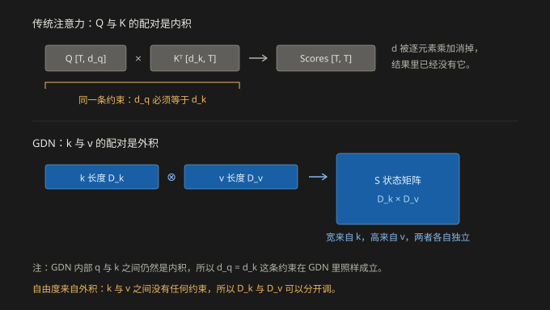
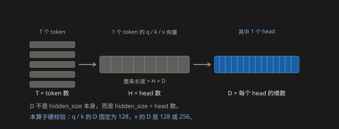
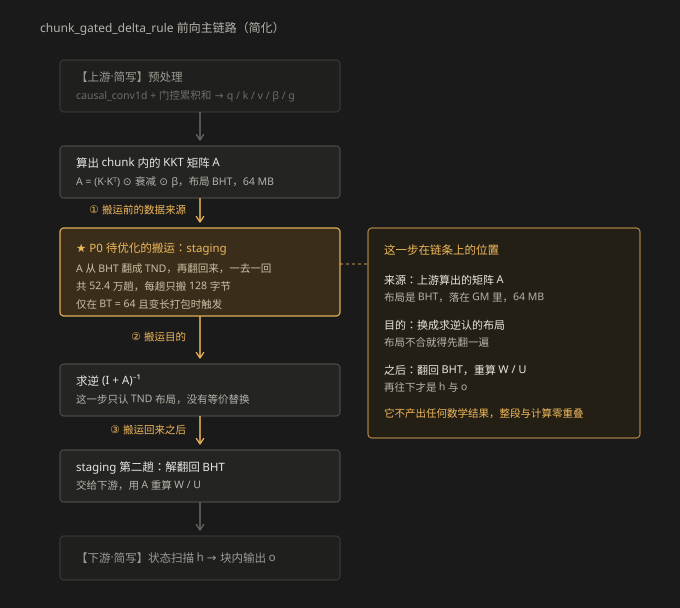
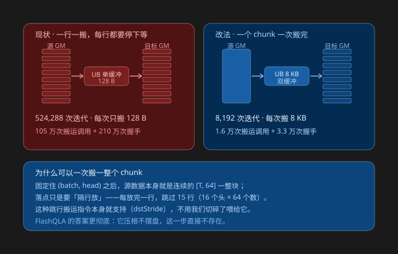

# GDN 的维度约定与 staging 搬运优化（P0）

> **本文回答三个问题**
>
> 1. 为什么 GDN 的 v 可以和 q / k 取不同的维度，而传统 Transformer 习惯上让三者同维；
> 2. `T`、`H`、`D` 这几个维度符号各指什么（含 $D_k$ 与 $D_v$，还有 `BT`）；
> 3. 算子内部有一段"数据搬运"（staging）值得优化（记为 **P0**）：它在算法链条的哪一环、慢在哪里、怎么改。
>
> **统一口径**：`B = 1`、`Hv = 16`、`T = 32768`、`BT = 64`、24 个 AI Core。所有收益数字都是**静态估算**，只用于判断"值不值得动手"，不替代实测。
>
> **代码范围**：`flash-linear-attention-npu/fla/ops/ascendc/gdn/`。第 2 节的主链路在 `chunk_gdn_fwd/chunk_gated_delta_rule_fwd/` 下，第 0、1 节的维度校验在 `chunk_gdn_fwd/chunk_fwd_o/` 下；下文 `文件:行号` 均相对这两个目录之一。
>
> **四张示意图**以独立 SVG 文件放在同目录 `assets/` 下。

---

## 0. 为什么 GDN 的 v 可以和 q / k 不同维

先把一个容易说岔的地方点明：

**在 GDN 里，q 和 k 仍然必须同维**——因为它们要做内积（`Q @ K^T`）。真正可以不一样的，是 **v 与 q、k 之间**。所以准确的说法是"k 与 v 可以不同"，而不是"q、k、v 三者互不相同"。

### 0.1 两种配对方式：内积会收缩维度，外积不会

把两个向量放在一起，只有两种配法：

- **内积**（`q · k`）：逐元素相乘再求和，**收缩掉一个维度**。要求两边长度相同，而且算完之后这个维度就从结果里消失了。
- **外积**（`k ⊗ v`）：两个向量分别变成结果矩阵的行和列，**两个维度都保留下来**，各自成为结果的一条边。



*上：传统注意力的 Q 与 K 是内积配对，被收缩掉的那一维必须相等，且算完就消失。下：GDN 的 k 与 v 是外积配对，两个维度分别成为状态矩阵 S 的宽和高，互相不约束。*

这张图是理解全文的钥匙：

- **传统注意力**：Q 与 K 是内积，所以 $d_q = d_k$ 是硬约束；而 `softmax(...) @ V` 这一步做的是加权求和，V 的列数（即 $d_v$）本来就不受约束。
- **GDN**：q 与 k 同样是内积，所以 $d_q = d_k$ 在 GDN 里照样成立；但 GDN 多了一对外积配对 `k ⊗ v`，这一对完全自由。

也就是说，**真正的差别不是"能不能不同"，而是"有没有动机去让它不同"**。

### 0.2 传统 Transformer：没有动机，于是习惯取等

标准实现里几乎总是取 $d_q = d_k = d_v = d_{\text{model}} / h$，原因有三条：

1. 多头拼接后要回到 $d_{\text{model}}$，取等最省事；
2. 三个投影可以共用同一种形状，代码简单；
3. **没有动机去改**—— $d_v$ 变大只是让计算和 KV cache 一起变大，收益说不清。

顺带说一句：算子接收的是投影之后的 q / k / v，本身看不到 $d_{\text{model}}$ 这个形状，所以它只关心"多少个 head × 每个 head 多少维"。

### 0.3 GDN：状态矩阵的两条边，各有各的用处

GDN 的状态更新是：

$$S_t = e^{g_t} S_{t-1} + \beta_t k_t v_t^\top$$

看最后那一项 $k_t v_t^\top$，这是**外积**：

- $k_t$ 的长度 $D_k$ 决定"写到状态矩阵的哪一列"，对应**宽度**；
- $v_t$ 的长度 $D_v$ 决定"写到哪一行"，对应**高度**。

结果是一个 $D_k \times D_v$ 的矩阵，两个方向的长度各自独立，没有任何约束要求它们相等。

这就带来一个传统注意力里不存在的动机：**状态矩阵就是线性注意力的 "KV cache"**，但它是一个固定大小的 $D_v \times D_k$ 矩阵，不随序列增长。于是 $D_k$ 和 $D_v$ 变成了"记忆容量"的两个旋钮，可以分开调——想让记忆宽一点就加 $D_v$，想让寻址维度省一点就减 $D_k$。

### 0.4 多头的含义也跟着变了

- 传统 Transformer 的多头是**并行的子空间**，各头算完拼起来，再过一个输出投影混合；
- GDN 的多头是**互相独立的递推通道**——每个 head 有一条自己的状态链，head 之间在算子内部完全不交互。

所以"头数"在 GDN 里就是**天然的并行度上限**：状态扫描阶段每条链只能自己串行往下走，并行宽度就等于 head 数。

### 0.5 实际支持的差异

有两类差异，别混：

| 差异类型 | 支持范围 | 出处 |
| --- | --- | --- |
| **head 数**不同 | v 的 head 数可以是 k 的 1 至 4 倍 | `chunk_fwd_o/op_host/chunk_fwd_o_tiling_processor.h:292-294` |
| **head 维**不同 | q/k 固定 128；v 可以是 128 或 256 | `chunk_fwd_o/op_host/op_api/aclnn_chunk_fwd_o.cpp:39-40`、`:107` |
| A5 上的收紧 | 强制 K = V = 128 | `chunk_fwd_o/op_kernel/chunk_fwd_o_a5_constants.h:16-17`、`chunk_fwd_o/op_host/chunk_fwd_o_tiling_processor.h:281` |

head 数不同是 GQA 式的用法——**多个 v 头共享一个 k 头**。

注意最后一行的性质：**"必须相等"是工程约束，不是数学约束。** $D_k$ 固定 128 是因为 cube 喜欢这个尺寸，A5 上强制 K 等于 V 是那一代的实现选择。所以"GDN 的维度可以不同"说的是**算法层面没有约束**，具体实现可以再收紧。

---

## 1. T / H / D 分别是什么



*T 是 token 数，H 是 head 数，D 是单个 head 的维数。D 不等于 hidden_size，而是 hidden_size 除以 head 数。*

| 符号 | 含义 | 在本算子里的取值 |
| --- | --- | --- |
| **T** | **token 数**，也就是序列长度 | 32768 表示"这条序列有 32768 个 token" |
| **H** | **head 数** | 要分 $H_K$（q/k 的头数）与 $H_V$（v 的头数），两者可以不同 |
| **D** | **单个 head 的维数** | q/k 固定 128，v 是 128 或 256 |

### 1.1 D 不是 embedding 之后的那个维度

这是最容易误会的一点。

假设模型 `hidden_size = 2048`、`head 数 = 16`，那么每个 head 的维度是 $2048 / 16 = 128$——**这个 128 才是 D**。

也就是说：

$$\text{hidden-size} = H \times D$$

**D 是"分成若干份之后的其中一份"，不是"合在一起的总长"**，比 embedding 维度小一个数量级。

### 1.2 这里的 D 其实是两个数

GDN 里 q/k 和 v 的 head 维是**分开校验**的：

- **q/k 的 $D_k$**：`chunk_fwd_o/op_host/op_api/aclnn_chunk_fwd_o.cpp:39` 硬写 `CHUNK_FWD_O_K_HEAD_DIM = 128`，不满足直接报错；
- **v 的 $D_v$**：128 或 256（同文件 `:40` 的 `MAX_V_HEAD_DIM = 256`），kernel 里到处是 `V_DIM == 256` 的分支——比如 `L0_K_TILE` 在 256 时会切成 64。

本文口径里的 `D = 128`，指的就是 $D_k$。验算一下就对得上：一个 bf16 的 `[T, H, D]` 张量每 token 字节数 = $H \times D \times 2 = 16 \times 128 \times 2 = 4096$ 字节，正是第 2 节用到的那个数。

### 1.3 BT 是什么，别和 D 混了

- **B** = batch，表示几条序列。口径里的 `B = 1` 指单条序列。
- **D** = 单个 head 内部的宽度，就是上一节的 $D_k$ / $D_v$。
- **BT** = **chunk size**，把序列切成一小段一小段之后，每一段装多少个 token。

**BT 就是一段里有多少个 token。** 但这里有个容易卡住的地方：**它同时也是"那段矩阵有多宽"**，因为要转置的那张矩阵 A 本身就是一张**方阵**：

- 横着数，是这一段里的 token 1、token 2 …… token 64；
- 竖着数，还是这一段里的 token 1、token 2 …… token 64。

它记录的是"这一段里，第 i 个 token 和第 j 个 token 之间的关系"。所以"一段装 64 个 token"和"矩阵一行是 64 个数"，**说的根本是同一件事，只是换成两个方向看**。这一点正是第 2.3 节"为什么一行是 BT 个数"的答案。

至于为什么取 64：这个值不是算子写死的，而是**调用方传进来的**，只允许 64 或 128 两种取值（`op_host/op_tiling/arch22/chunk_gated_delta_rule_fwd_arch22_tiling.cpp:205`）。本文所有口径都按 64 算。

**一句话记住**：BT 是"切 T 的刀"，D 是"head 内部的宽度"，两件事。

---

## 2. P0：一段值得优化的内部搬运

### 2.1 它在算法链条的哪一环



*前向主链路的简化示意。高亮的那格是唯一一处"为了迁就下游布局"而做的数据倒腾，夹在"算出矩阵 A"和"用 A 重算 W / U"之间。*

把它在链条上的角色概括成三句话：

- **搬运前的数据来源**：上游算出的矩阵 A。它是 chunk 内的 KKT 矩阵，形状 `[B, Hv, T, BT]`（代码注释称这个布局为 BNSD），在内存里按 head 排布，共 64 MB。
- **搬运的目的**：紧接着的求逆环节只认 TND 布局 `[B, T, Hv, BT]`，也就是按 token 排布。布局不合，算法层面没有等价替换，只能先翻一遍。
- **搬运之后**：翻成 TND、求完逆，还要再翻回 BHT，才能交给下游重算 W / U；再往下的状态扫描与块内输出都依赖这份结果。

这一段搬运**完全挂在关键路径上，没有任何计算与它重叠**——它不产出任何数学价值，纯粹是布局转换的税。

### 2.2 就这一环：一去一回，两次

矩阵 A 在内存里是**按 head 摆的**：形状 `[B, Hv, T, BT]`——最外层是 batch，然后是 head，再是 token。tiling 代码里的注释原话是 "Public A is always BNSD [B, Hv, T, BT]"（`op_host/op_tiling/arch22/chunk_gated_delta_rule_fwd_arch22_tiling.cpp:284`）。

注意这个文件位于 `op_host/op_tiling/arch22/` 下，和 kernel 侧那个同名的 `op_kernel/internal/arch22/chunk_gated_delta_rule_fwd_arch22.cpp` 是两个不同的文件——**搬运代码在 kernel 侧，A 的布局说明在 tiling 侧**，看引用时别混。

但接下来要给它做求逆的那套代码，**吃的是按 token 摆的**：形状 `[B, T, Hv, BT]`，head 和 token 两层换了位置。

于是流程变成：把 A 从"按头摆"翻成"按 token 摆" → 交给求逆 → 算完再从"按 token 摆"翻回"按头摆"。**一去一回，两次。** 调用点就在同一文件 `:288` 和 `:298`，同一行代码跑两遍，一次传 `true`、一次传 `false`。

这个"翻一遍"的动作叫 staging（可以理解成摆盘、中转）。打个比方：刚从车间出来的货是**按品类堆的**，但下一道工序的工作台只认**按订单堆的**，所以得先倒一遍垛，干完活再倒回来。

**算子内部自己干这件事，好处是外面调用的人不用管，坏处是内部要付两次整理的钱。** P0 说的就是这笔整理费。

还有一点要说清楚：**这笔开销只在特定形态下产生。** 触发条件是 `BT == 64` 且序列为变长打包（varlen），见同文件 `:266` 与 `:304` 的 `useTndStaging` / `abc.isVarlen != 0`。定长序列以及 `BT == 128` 的形态走的是 `aWorkspace` 直连求逆的路径，不存在这段搬运。

### 2.3 "一行"到底是什么，为什么只有 128 字节

现在代码里就是一个朴素循环：

> 搬一行 → 等它落地 → 再写出去 → 等它出门 → 下一行

这里的"一行"，指的是 A 这张矩阵**最内层那一段**。代码里它对应的就是 `rowParams{1, rowBytes, 0, 0, 0}` 这个参数（`op_kernel/internal/arch22/operators/chunk_kkt_solve_tri/op_kernel/solve_layout_staging.h:41`），而 `rowBytes = chunkSize * sizeof(T)`（`:36`）——**`chunkSize` 就是 BT，所以一行 = $BT \times 2 = 64 \times 2 = 128$ 字节。**

**为什么最小单位正好是 BT 个数？** 回到 A 的形状 `[B, Hv, T, BT]`：**要转置的只有外面两层（head 和 token 换位置），最里面那层 BT 是原地不动的。** 既然最内层不用重排，搬运自然就以它为最小单位，一次把它的全部搬走。

所以：

- "一行" = 某一个 `(batch, head, token)` 名下的 BT 个数；
- BT = 64，一行就是 128 字节。

这里有个容易误会的地方要点明：**"一行"不是"一个 token"。** A 的第 i 行记录的是"这一段里第 i 个 token 跟这一段全部 64 个 token 的关系"——**它是一个 token 对整个 chunk 的关系，而不是一个 token 本身。**

### 2.4 52.4 万趟是怎么算出来的

趟数就是把 A 的前三个维度直接乘起来：

$$\text{趟数} = B \times H_v \times T = 1 \times 16 \times 32768 = 524{,}288$$

换成白话：**每一个 token，在每一个 head 名下，都得单独搬一趟。** 16 个头乘 32768 个 token，就是 52.4 万趟，一趟 128 字节。代码里就是这一行（`solve_layout_staging.h:26`）：

```cpp
const int64_t rowCount = batchCount * headCount * tokenCount;
```

有了趟数，其余几个数就是它乘上一个固定倍数：

| 指标 | 怎么来的 | 数值 |
| --- | --- | --- |
| 搬一行的趟数 | $B \times H_v \times T$ | 524,288 趟 |
| 搬运调用 | 一趟要读一次、写一次 | 105 万次 |
| 跨 pipe 握手 | 一趟 4 次（读后一对、写前一对） | 210 万次 |
| 一去一回的总流量 | 一趟 128 B × (读 + 写) × (去 + 回) | 256 MB |

三个毛病叠在一起，而且**互相放大**：

1. **一次只搬 128 字节。** 搬运有固定启动开销（发起、寻址、握手），这个开销摊在 128 字节上就特别贵。
2. **只有一个中转缓冲区（单缓冲）。** 进和出用的是同一块地，所以必须先"等它落地"才能往外写，两次搬运之间**零重叠**。
3. **每行 4 次跨流水线握手。** 而且 `SetFlag` 后面**紧跟同一个 id 的 `WaitFlag`**，中间没有任何别的指令——等于刚举完手就立刻等人应，纯粹是白花时间（`solve_layout_staging.h:58-62`）。

打个比方：用大卡车运 52 万箱货，**一次只装一箱**，装完必等车停稳，卸完必等车回库。货一点没多运，时间全耗在起步停车上了。

顺便把流量对一下账：A 总共 64 MB，也就是 $B \times H_v \times T \times BT \times 2$ 字节。一读一写翻倍成 128 MB，再去回两趟，正好 256 MB。

最扎心的一点：后面那个求解器**真正需要读的数据只有 64 MB，按带宽算 40 微秒**。而为了把它摆好位置，先付了 2.2 到 8.6 毫秒——**搬运开销是它服务对象的 50 到 200 倍**。而且这段是**完全挂在关键路径上的**，没有任何计算跟它重叠，所有人就在那干等。

### 2.5 改法的思路：为什么能一次搬一整个 chunk



*左：现状逐行搬运，52.4 万趟、每趟只有 128 字节。右：改法一个 chunk 一趟搬完 8 KB，一共 8192 趟。底部说明为什么成块搬运在地址上是成立的。*

关键在于——**这个转置的地址规律其实特别简单**，只是现在的代码没用上。

转置的本质是把 `(b, h, t, c)` 变成 `(b, t, h, c)`（`c` 就是最里面那层的位置，长度是 BT）。把 `(batch, head)` 固定住之后再看：

- **源那边**：就是一个 `[T, BT]` 的连续矩阵，一行挨着一行，中间没有任何空隙；
- **目标那边**：每一行还是那 BT 个数，只是行与行之间要**空开 15 行**——因为中间得插另外 15 个 head 的数据。

也就是说：**要搬的东西本来就连着，只是落点要"隔行放"。**

而"隔行放"这件事，**搬运指令自己就支持**——指令里有个参数叫 `dstStride`（目标行间距）。只要告诉它"每放完一行，跳过 15 行"，它自己会跳。

那还一行一行搬什么呢？**一次搬一个 chunk 就行**：一个 chunk 是 64 行乘 64 个数，等于 8 KB，源侧连续读进来，写出去的时候让硬件自己跳行距。

**8,192 这个数是怎么来的？** 因为一趟搬一个 chunk，而一个 chunk 里面有 BT = 64 行，所以趟数正好除以 64：

$$524{,}288 \div 64 = 8{,}192$$

换个方向数也一样：一条序列被切成 $T / BT = 32768 / 64 = 512$ 个 chunk，再乘上 16 个 head，就是 $512 \times 16 = 8{,}192$。

改完的变化：

| 量 | 现在 | 改后 | 倍数 |
| --- | --- | --- | --- |
| 搬一行的趟数 | 524,288 | 8,192 | **64 倍** |
| 搬运调用 | 105 万 | 1.6 万 | 64 倍 |
| 握手次数 | 210 万 | 3.3 万 | 64 倍 |
| 数据量 | 256 MB | 256 MB | **没变** |

**一句话：不是少搬了，是少停了。** 流量一点没省，省的是每次搬运前后的"起步停车"。

另外两个顺带的好处：UB 只要 8 KB（双缓冲 16 KB，完全放得下）；**尾块不用特判**——`L` 直接取这个 chunk 的实际长度就行。

还有个**中间档**，如果不想碰地址计算：光加一个 ping-pong 双缓冲（保持逐行粒度），就能让"进"和"出"重叠、把每次的等待折掉一半，拿 **1.1 到 4.3 ms**。这是"改十几行拿一半"的版本，适合当第一步。

### 2.6 更彻底的答案：让这段搬运不存在

另一份同类算子的 CUDA 实现（FlashQLA）给出的答案不是"搬得更便宜"，而是——**它根本不摆盘。**

它原生就吃自然布局，算 `k·kᵀ` 的时候直接对 `k` 做转置取数（`kkt_solve.py:108-110` 的 `transpose_B=True`），让 cube 自己去内积维上读。**整条 staging 通路在它那儿压根不存在。**

两条路的性质不一样：

- **优化这里的 P0** = 把这道税交得更便宜（少停 64 倍）；
- **FlashQLA 的做法** = 这道税根本不用交。

**所以真正的动作顺序应该是**：先花点力气确认"NPU 的 cube 能不能对内积维做转置取数"（或者 `DataCopyPad` 的 stride 是否已经够用）。**如果能，staging 整段可以直接删掉——比优化它更值。**

需要诚实标注的是：**这条路尚未验证可行性**，是从 FlashQLA 倒推出来的猜想。所以它和 P0 不是互斥关系，而是"确定能做、风险低"与"如果成立、收益更大"的两条路，可以并行去查。

### 2.7 为什么把它排第一

三条理由，都很实在：

- **改动面小**：一个循环的粒度，加上两个参数（`blockCount`、`dstStride`）和地址计算。不碰别的模块、不改算子接口、不涉及精度。
- **独立可做**：不需要先搞清楚别的瓶颈在哪。
- **一眼可验证**：改完前后各跑一次 `msprof`，看这段 timeline——从"密密麻麻的小箭头"变成"几根粗箭头"，肉眼就能确认。

**最后交代不确定性**：2.2 到 8.6 ms 是静态估算，前提是"这段耗时确实由启动与握手主导"。理论上界是这段完全消失，下界是 0（如果它其实已经被别的核盖住了）。倾向偏上界——128 字节确实太小、这段确实零重叠——但**动手前先抓一条 timeline 是稳赚的**。
