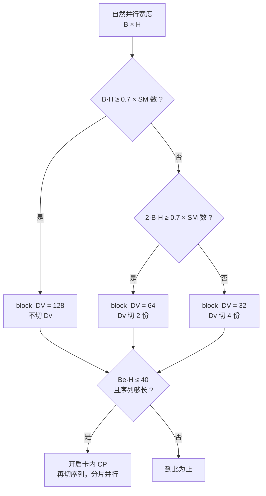

# Qwen FlashQLA（CUDA / TileLang 版 GDN）优化点分析

> 对象：`D:\Code\FlashQLA`（Qwen 团队，基于 TileLang，支持 SM90 / SM100 / SM103 / SM120）
> 前序材料（本仓库）：`gdn_impletiion.md`（vllm-ascend Triton 路径 P1–P5）、`gdn_fused_op_opt.md`（CANN 融合算子 F1–F5）、`gdn_ascendc_data_move.md`（现网 AscendC 版 P0–P2 与 §7 非搬运结论）
> 口径：只做**静态代码分析**，所有收益引用自其自带 benchmark（`benchmark/benchmark_results_H200.txt`）或本文的静态推算，落地前必须实测。

---

## 0. 一句话结论

**在「融合」和「布局」两个维度上，FlashQLA 的做法和我们前面三条分析高度一致——这反过来说明那些结论是对的。**

但在**唯一一处真正的结构性瓶颈**上，它走了一条我们没走的路：

- 我们三条分析都独立发现了同一个瓶颈：**状态扫描阶段的并行宽度等于 head 数**（CANN 融合算子的 stage2 只占 $N_v$ 个核；现网 AscendC 版 H 阶段 `taskNum = batch × vNumHead`）。
- 我们给出的解法都是**按 $D_v$ 切分**（F1），并且都注明了天花板： $k \le \lfloor \text{aiCoreNum} / N_v \rfloor$，再往上「必须同时切 $D_k$，代价更高」。
- **FlashQLA 的解法是三轴级联**：先切 $D_v$（免费）→ 不够就**切序列（卡内 CP）**，并用 gate 的指数衰减把跨分片依赖压成 O(分片数) 个小矩阵乘。

**「卡内序列并行 + 衰减截断预热 + 精确传播子」这一条我们完全没提，是本次最值得借鉴的东西。** 详见 §3.1。

---

## 1. FlashQLA 的形态速览

### 1.1 kernel 切分：按「并行宽度」而不是按「数学阶段」

前向只有 **3 个 kernel**（`chunk/__init__.py:47-86`）：

```
chunk_local_cumsum(g)                     → g 的 chunk 内前缀和
kkt_solve(k, beta)                        → A = (I + StrictLower(beta ⊙ K Kᵀ))⁻¹
fused_gdr_fwd(q, k, v, A, g, beta)        → recompute_w_u + fwd_h + fwd_o 三段合一
```

关键是**为什么这么切**：

| 阶段 | 天然并行宽度 | FlashQLA 的处理 |
| --- | --- | --- |
| cumsum | `B · H · NT`（很宽） | 独立 kernel |
| KKT + solve | `B · H · NT`（很宽） | 独立 kernel（`kkt_solve.py:214`，`T.Kernel(num_chunks*H)`） |
| recompute W/U + fwd_h + fwd_o | **只有 `B · H`（很窄）** | **融成一个 kernel**，然后补并行度（§1.2） |

README 里那句 "Rather than following the step-by-step decomposition into independent kernels, nor fusing the entire computation flow into a single kernel" 说的就是这件事：**它不是「融得越多越好」，而是「把并行宽度同样窄的几段融在一起」。**

对照 CANN 融合算子：它是「四个阶段全融成一个 kernel」，代价是每 group 3 次全局 `SyncAll`（`chunk_gated_delta_rule_arch22.h:201-233`）。两条路线的取舍点很清楚——**barrier 成本 vs 中间量落盘成本**。

### 1.2 并行度恢复：三轴级联



- **轴一：切 $D_v$**（`fused_fwd.py:107`）
  `T.Kernel(T.ceildiv(DV, block_DV) * batch_size * H, threads=512)`
  `block_DV` 由 `TARGET_NUM_CTAS = int(MULTI_PROCESSOR_COUNT * 0.7)`（`fused_fwd.py:12`）三档自适应选 128 / 64 / 32（`:730-736`）。
  **这一轴不需要任何跨 CTA 通信**——状态的 $D_v$ 各列互相独立， $D_v$ 切分天然无耦合。这正是我们 F1 提的「按 $D_v$ 切分」，而且它把「切多少」交给了一个**基于 SM 数的显式占用率模型**，而不是写死。

- **轴二：切序列（卡内 CP）**（`cp_context.py:106-124`）
  触发条件是一个量化占用率判据：`Be · H ≤ 40`（SM90 / SM120），或 `Be · H ≤ 56 且 max(num_chunks) ≥ 128`；SM100 的前向更严（`≤56` 需 `≥256` chunk，`≤32` 可降到 `≥192`）。其中 `Be = Σnum_chunks / max(num_chunks)` 是「折算到 chunk 单位的有效 batch」。
  源码注释把意图写得很直白（`cp_context.py:102-104`）：
  > `Disable CP when sequences are too short or B * H naturally saturates SM occupancy. CP has fixed overhead (warmup + correct_initial_states) that only pays off when the longest sequence has enough chunks to amortize the cost.`

- **分片长度也是算出来的**（`cp_context.py:63-72`）：
  ```
  # Latency model: T = a·L_cp + b·(B·H·Lc/P) / L_cp
  # Minimizing T yields    L_cp* ∝ √(B·H·Lc / P)
  max_local_chunks = 2 ** round(log2(sqrt(H * sum(num_chunks) / P) * 3))
  max_local_chunks = max(max_local_chunks, 4)   # 保证 fused_gdr 至少 4 级流水
  ```
  即**最优分片长度 ∝ √(总工作量 / 核数)**，再乘一个经验因子 3、对齐到 2 的幂、下限 4。

### 1.3 并行度放大有多猛（以 TP8、1×32768 为例）

代进它自己的参数（ $H=8$、chunk = 64、总 chunk 数 512、H200 的 $P = 132$）：

| 量 | 计算 | 结果 |
| --- | --- | --- |
| `TARGET_NUM_CTAS` | $0.7 \times 132$ | 92 |
| 无 CP 时的 `block_DV` | $B \cdot H = 8 < 92$ 且 $16 < 92$ | 32（Dv 切 4 份） |
| 无 CP 时 grid | $4 \times 1 \times 8$ | **32 CTA（0.24 波）** |
| `Be·H` | $1 \times 8 = 8 \le 40$ | **CP 开** |
| `L_cp` | $2^{\text{round}(\log_2(\sqrt{8 \times 512 / 132} \times 3))}$ | 16 chunk = 1024 token |
| 分片数 | $512 / 16$ | 32 |
| 有 CP 时 grid | $4 \times 32 \times 8$ | **1024 CTA（约 7.8 波）** |

**并行度 ×32。** 这就是它在这个配置上能拿到 2.81x（vs FLA）的原因。

同一张表也解释了它 benchmark 里的规律：**head 越少、序列越长，机制命中越多、加速越大**。

| 配置（1×32768） | `h_v` | 命中机制 | vs FLA |
| --- | --- | --- | --- |
| TP8 | 8 | Dv 切 4 + **CP** | **2.81x** |
| TP4 | 16 | Dv 切 2 + **CP** | 2.50x |
| TP2 | 32 | Dv 切分 + 部分 CP | 2.13x |
| TP1 | 64 | 仅 Dv 切 2（`Be·H = 64 > 40`，CP 关闭） | 2.19x |

反过来，**对比 FlashInfer 时 TP1 是 0.8 至 1.0x（打不过）**，TP8 才是 3.5 至 5.2x。也就是说 **FlashQLA 的优势是"集中"的，不在高并行度区间**——它是为「head 少、序列长」这个 Qwen3.5/3.6 的实际部署形态定制的。

### 1.4 代数重构：省掉每 chunk 一次 matmul

标准 FLA 的 fused 三段（`recompute_w_u + fwd_h + fwd_o`）每 chunk 合计 **7 次** gemm：算 `w`、算 `u`、`w @ S`、`Kᵀ @ v_new`、`Q @ Kᵀ`、`Q @ S`、`P @ v_new`。FlashQLA 只用 **6 次**，省掉的是「算 `w`」那一次：

```cpp
// CONSUMER_V（fused_fwd.py:303-339）
U  = K @ S                       // 先算，得到"w 作用在 S 上"的效果
W  = V - g_exp ⊙ U               // 逐元素，把 chunk 内衰减折进来
V' = A_g @ W,  A_g = A ⊙ G ⊙ b    // 一次 gemm（:392-399）
// CONSUMER_S（:240-256）
S  = e^{g_last} · S + Kᵀ @ V'     // 状态递推只有这一次 gemm
// CONSUMER_O（:369-435）
P  = Q @ Kᵀ                      // 块内注意力矩阵
O  = Q @ S;  O *= scale · e^{g}
O += Pg @ V',  Pg = scale · G ⊙ P
```

对照一下：标准做法要先把 `w = T(β ⊙ k)` 算成 `[C, D_k]`，再 `w @ S`；FlashQLA 把顺序倒过来——**先 `K @ S`，再让含 `β` 与衰减的 `A_g` 作用在 $D_v$ 侧**，于是「算 `w`」那一整次 matmul 就不需要了。

**为什么这次 matmul 值得省**：`w = T @ (β ⊙ k)` 的规模是 `[C,C] × [C, D_k]`，在 $C = 64$、 $D_k = 128$ 下是 524 K MAC，占 7 次 gemm 总 MAC 的相当一块；而它省掉后并不增加别的 gemm（`K @ S` 本来就要算，只是从 `w @ S` 换了形式）。

逐元素因子全部内联，不单独物化：`a_fragment *= g_fragment; a_fragment *= b_shared[j_t]`（`:394-399`）。
**这正好对上 CANN 那份文档里的 F2b**（「把 beta / exp(g) 折进 attn，删掉 `vBetaWs` / `gBKWs`」）——只是它做得更彻底，连 `w` 本身都没了。

另外确认一点：**`W` / `U` / `V'` 全程不落 HBM**，只在 shared memory 与 fragment 间原地复用（`v_shared` 被 W 覆盖，注释 `S2[V] W`，`:326-328`）。只有 `A` 真写回 HBM（`kkt_solve.py:304`），因为反向要用。这和我们 P3「②③④ 中间量往返」要解决的问题是同一件。

### 1.5 SFU 削减：全仓零 `T.exp`

全文搜索确认：**FlashQLA 里 `T.exp(` 出现 0 次，全部用 `T.exp2(x * 1.442695)`**（1.442695 = $\log_2 e$）。例如 `fused_fwd.py:286`、`:290-296`、`:386-387`，`prepare_h.py:209-210`、`:320`、`:352-356`。

理由是把昂贵的通用 `exp` 换成硬件原生的 `exp2`，再乘一个常数。README 里 "reducing ... SFU overhead" 指的就是这类改写。

### 1.6 精度策略：求逆全程 fp32，只有落盘降精度

`kkt_solve.py` 里所有求解中间量（`a16i_shared` / `a32o_shared` / `a32i_fragment` …）都是 `accum_dtype` = **fp32**；只有最终的 `a64_shared`（也就是要落盘的 `A`）是 `qkva_dtype` = bf16/fp16（`:74`、`:304`）。

$$
\text{求逆：fp32} \quad\longrightarrow\quad \text{落盘 } A\text{：bf16}
$$

这解释了它宣称的 "without sacrificing numerical precision"——**精度损失只发生在输出侧的量化，不发生在求逆的累加里**。

顺带一提，它的块内求逆结构与 CANN 的 arch22 高度相似：4 个 16×16 对角块前代（`:132-146`）→ 2 组 16×16 耦合（`:149-163`）→ 32×32 与 64×64 组装（`:166-194`）。差别在 SM120 上它直接改成单级 32×32（`blackwell_sm120/kkt_solve.py:63`，`a32_fragment`）——**说明块求逆的最优粒度与硬件强相关**。

---

## 2. 与前面三条分析的逐条对照

### 2.1 能对上的（说明我们前面的结论是对的）

| 我们的结论 | 出处 | FlashQLA 的做法 | 判定 |
| --- | --- | --- | --- |
| **P1 / P2**：进侧与出侧布局对齐各占 21.4% 流量，应该「让 kernel 吃自然布局」而不是外部转置 | `gdn_impletiion.md` §6 | 原生吃 `(1, num_tokens, Hg, DK)` 布局 + `async_copy` 直读，**完全没有 staging 这一步** | ✅ 对得上，且更彻底 |
| **P3**：②③④ 中间量算子间往返占 11.3% | 同上 | `kkt_solve` 合并 KKT + solve；`W`/`U`/`V'` 不物化 | ✅ 对得上 |
| **P4**：⑤⑥ 融合 + 状态池，`h` 不物化（58.7%） | 同上 | `recompute_w_u + fwd_h + fwd_o` 三段融成一个 kernel，默认 `output_h=False` | ✅ 对得上 |
| **CANN F2**：把 `beta` / `exp(g)` 折进 attn，删掉 `vBetaWs` / `gBKWs` | `gdn_fused_op_opt.md` §4 | `A_g = A ⊙ G ⊙ b` 三次逐元素乘内联，连 `w` 都不物化 | ✅ 对得上，做得更彻底 |
| **CANN F3**：matmul 流水化 | 同上 | 手写 warp specialization + 多 stage + 双缓冲 smem（`q_shared/(2,...)` 等） | ✅ 对得上 |
| **CANN F5**：常量收敛 | 同上 | 阈值、分片长度、`block_DV` 全是可调参数而非硬编码 | ✅ 对得上 |
| **现网 P0**：TND staging 逐行单缓冲，应改成分块搬 | `gdn_ascendc_data_move.md` §3 | **不需要 staging** | ⚠️ 方向一致，但它给的是更彻底的答案（见 §2.3） |
| **现网 P1**：`UB2L1` 直连实测更慢，跨核同步 > GM 往返 | 同上 §4 | 同样选择走 GM/HBM（`A` 落盘、`h` 不进 shared 跨 kernel） | ✅ 一致 |
| **现网 §7**：H 阶段并行宽度 = `B·Hv`，24 AIC 上只有 67% 利用率，**不算稳妥收益** | 同上 §7.1 | **轴一 + 轴二直接解决** | ⭐ **它给出了那条「稳妥的路」** |

### 2.2 对不上的（它做了我们没做的）

| FlashQLA 的优化点 | 我们前面有没有 | 说明 |
| --- | --- | --- |
| **卡内 CP（序列切分）+ 衰减截断 + 精确传播子** | ❌ 完全没提 | 我们只想到切 $D_v$ / $D_k$，没想过切序列 |
| **基于占用率的自适应调度**（`TARGET_NUM_CTAS = 0.7 × SM`、`L_cp ∝ √(work/P)`） | ❌ 没提 | 我们的文档里「切多少」都是定性讨论 |
| **`exp2` 替代 `exp`** | ❌ 没提 | 我们只提了「删掉不必要的物化」，没提换更便宜的初等函数 |
| **求逆 fp32 + 落盘降精度** | ⚠️ 提到了精度策略差异，但没当成优化项 | CANN 那份指出 arch22 用 fp32 solve、arch35 用 fp16；FlashQLA 给了一个「两者兼得」的折中 |
| **按并行宽度切 kernel** | ⚠️ 隐含提到（CANN 的 barrier 问题） | 没有把它提升为一条设计原则 |
| **`num_unmasked_iters`：掩码只在最后一轮做**（`fused_fwd.py:139-141`） | ❌ 没提 | 微优化 |

### 2.3 一处值得注意的"同向但更彻底"

现网 AscendC 版的 **P0**（TND 布局 staging 逐行单缓冲）我们给的解法是「把 staging 改成分块搬，迭代次数降 64 倍」。FlashQLA 的答案是**这一步根本不需要存在**——它原生消费 `(T, H, D)` 布局，`kk^T` 直接对 `k_shared` 做 `transpose_B=True` 的 gemm（`kkt_solve.py:108-110`）。

**启示**：P0 是"把税交得更便宜"，FlashQLA 是"不用交税"。如果 NPU 侧的 cube 也能对内积维度做转置取数（或 `DataCopyPad` 的 stride 已经支持），那 staging 可以直接删掉——这比优化它更值。**这一条值得在 NPU 上单独确认可行性。**

---

## 3. 最值得借鉴的四条

### 3.1 ⭐ 卡内 CP：用「预热窗口 + 精确传播子」把跨分片依赖压成小矩阵乘

这是本次最有价值的一条，也是唯一一条我们前面三条分析都没覆盖的。它要解决的问题和我们**完全一样**：并行宽度不够。

#### 3.1.1 数学结构

设序列被切成 $n$ 个分片，分片 $i$ 的初始状态记 $h_0^{(i)}$，则该分片从零态出发跑完自己的 chunks 得到的"终态"记 $\tilde{h}_i$，而真实终态是 $h_0^{(i)}$ 的线性函数：

$$
h_0^{(i+1)} = \tilde{h}_i + M_i \, h_0^{(i)}
$$

其中 $M_i$ 是这条递推在**预热窗口内**的精确线性传播子（ $[D_k, D_k]$ 矩阵）。

- $\tilde{h}_i$：从**零初始状态**出发、只跑分片末尾 `num_warmup_chunks` 个 chunk 得到的终态；
- $M_i$：在同一窗口内累加得到的传播子（`prepare_h.py:253-326`，`M += Xᵀ @ Z`，最后整体乘 $e^{g_{\text{prod}}}$）；
- 当窗口覆盖整个分片时，上式**精确成立**（代码里用 `fallback_mask` 走这条精确分支）；
- 否则，用 $h_0^{(i+1)} \approx \tilde{h}_i$ 近似，**误差由窗口外的衰减决定**。

关键在于：**跨分片的串行链长度从 O(chunk 数) 降到 O(分片数)**，而且每一步只是一个 $D_k \times D_k$ 的小矩阵乘（ $128^3 = 2.1$ MFLOP，可以忽略）。真正的重活（每个分片内部的递推）已经完全并行。

实现见 `cp_fwd.py:296-374` 的 `correct_initial_states`：串行走过每个分片，`h_fragment = ht_buffer[idx] + M @ h_prev`。

#### 3.1.2 「衰减截断」怎么定：一个显式阈值 + 逐 head 自适应

窗口长度不是拍出来的，是从 gate 里算出来的（`cp_fwd.py:52-71`）：

```
从段尾往前逐 chunk 累加 g[..., chunk 末位]        // g 在 log 域，累加即乘性衰减
if g_cumsum[i_h] < threshold and n_fragment[i_h] == num_iters:
    n_fragment[i_h] = i_s + 1                     // 到这里截断
    f_fragment[i_h] = False                       // 不需要精确修正
```

- 阈值常量：`warmup_threshold: float = -10.0`（`cp_context.py:156`，`cp_fwd.py:86`）。
  累计衰减到 $e^{-10} \approx 4.5 \times 10^{-5}$ 就认为更早的贡献可忽略。
- **注意它是 per-head 的**（`g_cumsum[i_h]`、`n_fragment[i_h]`）——每个 head 的衰减速度不同，窗口长度也不同。这是个很细的设计。
- 如果整段都没跌到阈值以下，就置 `fallback_mask = True`，走精确路径。**近似/精确是显式开关，不是隐式假设**，误差可解释、可回退。
- 反向还有双向版本 `get_warmup_chunks_bidi`（`cp_fwd.py:118`），同时从段尾往前（求初始态）和从段首往后（求终态 `dht`）累加，取两者较大值。

#### 3.1.3 代价与收益（TP8、1×32768）

| 项 | 量 |
| --- | --- |
| 预热重算 | 32 分片 × 约 4 chunk（下限 4）= 128 次 chunk 级状态更新，占主循环 512 次状态更新的 **25%** |
| `correct_initial_states` 串行链 | 32 步 × 2.1 MFLOP ≈ 67 MFLOP，**可忽略** |
| 额外 kernel launch | 2 个（`get_warmup_chunks` + `fused_gdr_h`） |
| **换来的并行度** | **×32** |

**25% 的额外状态更新换 32 倍并行度**——显然划算，而且序列越长、head 越少越划算。

#### 3.1.4 迁移到 NPU 侧

这条思路**纯算法、与后端无关**，直接可以用在两个地方：

| 落点 | 现状 | 可借鉴的点 |
| --- | --- | --- |
| **CANN 融合算子 stage2**（`gdn_fused_op_opt.md` F1） | 串行链只占 $N_v$ 个核，占每轮 cube 时间的 **75%**，我们给的解法是「按 $D_v$ 切分， $k$ 最多 2」 | 除 $D_v$ 外再加**序列维**——`Nv × k × S` 可以一直加到核数满 |
| **现网 AscendC 版 H 阶段**（`gdn_ascendc_data_move.md` §7.1） | `taskNum = batch × vNumHead`，24 AIC 上 `B=1,Hv=16` 只有 **67% 利用率**；我们判为「不算稳妥收益」 | **这条把它从"要重构"变成"有一条成熟路径可抄"** |

**但必须注意三个前置条件**（都是它代码里写明或可读出来的限制）：

1. **它只在 `batch_size == 1` 时开 CP**（`cp_context.py:165-166`、`:255-256` 的 `if batch_size > 1: return`）。所以它服务的是**单条超长序列**场景，不是 varlen 打包。
   → **NPU 侧如果要用于 varlen 服务场景，这块需要自己扩展**，不能直接抄。
2. **它没有解决"分片间串行"本身**，只是把串行步的粒度从 chunk 降到分片，并且每一步很便宜（ $D_k \times D_k$）。分片数很大时这条链仍会变成新的瓶颈。
3. **预热重算是纯额外开销**——序列短或分片多的时候会倒亏，所以它才要 `Be · H ≤ 40` 和「最长序列 ≥ 128/192/256 chunk」双条件。

### 3.2 把「占用率模型」写进 host 侧调度

FlashQLA 的 host 侧不是一个写死的配置，而是两个显式模型：

```python
# 轴一：Dv 切几份
TARGET_NUM_CTAS = int(MULTI_PROCESSOR_COUNT * 0.7)      # fused_fwd.py:12
block_DV = 128 if B*H >= TARGET_NUM_CTAS else (64 if 2*B*H >= TARGET_NUM_CTAS else 32)

# 轴二：序列切多长
# T = a·L_cp + b·(B·H·Lc/P)/L_cp   →   L_cp* ∝ √(B·H·Lc/P)
max_local_chunks = max(2 ** round(log2(sqrt(H * Σchunks / P) * 3)), 4)
```

**可借鉴的点**：把「要不要切、切多少」从人工经验变成**可计算的判据**。NPU 侧完全可以照做：

- 用 `aiCoreNum` 替 `MULTI_PROCESSOR_COUNT`；
- 用 `B · Hv` 判是否要切 $D_v$；
- 用类似的平方根律决定分片长度，并把「至少几级流水」设成下限。

而且它把模型放在 **host 侧 Python**（`cp_context.py`），kernel 只吃结果——**这对 NPU 侧很友好**，因为 tiling 本来就是 host 侧算的。

### 3.3 按「并行宽度」而不是「数学阶段」切 kernel

这条是设计原则，比任何单点优化都值：

> **并行宽度同样窄的阶段应该融进同一个 kernel（并给它补并行度）；并行宽度天然很宽的阶段应该单独放，别把它拖进窄 kernel 的 barrier 节奏里。**

对照 CANN 融合算子的问题：stage1 / stage3 的并行宽度是 `Nv × numChunk`（很宽），stage2 只有 `Nv`（很窄）。三者融进一个 kernel、用 3 次全局 `SyncAll` 对齐——结果是**每次 barrier 都让宽阶段陪窄阶段一起等**。

FlashQLA 的选择是：把宽的（KKT + solve）单独一个 kernel，把窄的三段融在一起。**代价是 `A` 要落一次 HBM，收益是少掉大量全局 barrier。**

这两条路线没有绝对优劣，但**判据是清楚的**：如果 barrier 成本 > 中间量落盘成本，就该拆。而 `gdn_fused_op_opt.md` 里"每 group 3 次 `SyncAll`"加上「workspace 按 `maxGroupLength` 而非 $T$ 分配」这两件事，说明 CANN 那版已经为 barrier 付了不小的代价。

### 3.4 三个可以立刻试的微优化

| 优化 | FlashQLA 的做法 | NPU 侧的可行性 |
| --- | --- | --- |
| `exp2` 替代 `exp` | 全仓零 `T.exp`，一律 `exp2(x * 1.442695)` | **需要单独验证**——CUDA 上是为了省 SFU，NPU 的 `exp` 在 Vector 单元，收益结构不同；如果 NPU 也有原生 `exp2` 而 `exp` 是软件展开，就能直接拿 |
| 求逆 fp32 + 落盘降精度 | 求逆全程 fp32，只有 `A` 落盘用 bf16 | **直接可用**：CANN 的 arch35 目前 32×32 solve 走 fp16，可以考虑改成「内部 fp32 + 落盘降精度」，在不增加带宽的前提下减小精度风险 |
| 掩码只在最后一轮做 | `num_unmasked_iters = 长度 ÷ block_S`，主循环不带掩码 | 直接可用，属于低风险微优化 |

---

## 4. 不能照搬的部分（硬件差异）

| FlashQLA 依赖的东西 | 位置 | NPU 上的替代 |
| --- | --- | --- |
| **TMA + mbarrier** 的 producer/consumer 流水 | `fused_fwd.py:175-184`、`:458`（`tma_copy` / `alloc_barrier`）；`fused_bwd.py` 有 16 个 mbarrier | 换成 MTE/Cube/Vector 的 pipeline stage + event flag。**语义相近但收益不同**——TMA 是免寄存器的整块搬运，NPU 的 `DataCopyPad` 要经过 UB |
| **`set_max_nreg` + 4 个 warpgroup 手工特化** | `fused_fwd.py:188-196`：S=160、V=128、O=128、producer=32 寄存器/线程 | 依赖 256 KB 级寄存器文件与「线程级」资源划分；**NPU 是固定的 UB / L1 / L0 划分，没有等价 API**。可借鉴的是"给不同角色分不同资源"这个思路，不是具体数值 |
| **`ldmatrix` / swizzled layout** | `fused_fwd.py:186` 的 `T.use_swizzle(10)`、`T.annotate_layout(make_linear_layout(...))` | 由 L1/L0 的 fractal 布局与 Cube 指令取代 |
| **块求逆的粒度**（SM90 用 64、SM120 用 32） | `kkt_solve.py:74` vs `blackwell_sm120/kkt_solve.py:63` | **结论同样适用**：块粒度必须按硬件重选，不能照抄 16/32/64 |

另外两条**架构本身**的限制，抄之前要知道：

1. **CP 只在 `B = 1` 时生效**（`cp_context.py:165`）——不是缺陷，是它刻意把 CP 定位成"单条超长序列"的补丁。用到 varlen 打包的在线服务上要自己扩展。
2. **它明确不做"全融合"**——`A` 一定落 HBM（因为反向要用），反向还强制重算 `h`（`__init__.py:131-138`）。所以它并没有追求"算子数最少"，而是追求"每个 kernel 都在满占用率下跑"。

---

## 5. 结论与建议动作

**结论**：

1. **融合与布局维度**：FlashQLA 的做法与我们前面三条分析**高度一致**（KKT+solve 合并、`W`/`U` 不物化、`h` 不物化、`beta`/`exp(g)` 内联、原生吃自然布局）——**这反过来验证了 P1–P5 / F1–F5 的方向判断是对的**。
2. **并行宽度这个结构性瓶颈**：它给出了我们没走的那条路——**除切 $D_v$ 外，还可以切序列**，并用「衰减截断预热 + 精确传播子」把串行链从 O(chunk) 降到 O(分片)，代价仅 25% 的额外状态更新换来 32 倍并行度。
3. **它的收益是"集中"的**：head 越少、序列越长越强（TP8 下 2.81x），高并行度区间甚至打不过 FlashInfer（TP1 下 0.8x）。**它不是普遍更快，而是专门补"并行宽度不够"这块短板。** 这恰好是 NPU 侧的问题——NPU 的核数更少，短板只会更早出现。

**建议动作（按性价比排序）**：

| 优先级 | 动作 | 落点 | 理由 |
| --- | --- | --- | --- |
| **1** | 把「序列维切分 + 衰减截断预热 + 精确传播子」作为独立课题论证 | CANN 融合算子 stage2 / 现网 AscendC H 阶段 | 唯一能突破 `k ≤ ⌊aiCoreNum/Nv⌋` 天花板的路径；纯算法、与后端无关 |
| **2** | 确认 NPU 的 cube 能否对内积维做转置取数 | 现网 AscendC 的 TND staging（现网 P0） | 若能，staging 可**直接删除**，比"优化 staging"更值 |
| **3** | 把 host 侧调度改成显式占用率模型 | 两处 tiling | `0.7 × aiCoreNum` 判据 + 分片长度的平方根律，改动小、可解释 |
| **4** | 拿测 `exp2` 替代 `exp` 的收益 | 现网 AscendC 的向量通路 | 成本极低，但需先确认 NPU 上 `exp` / `exp2` 的相对代价 |
| **5** | solve 改「内部 fp32 + 落盘降精度」 | CANN arch35 的 32×32 solve | 不增带宽的前提下减小精度风险 |

**动手前的第一件事**：和前面两份文档一样——**先抓一条完整 timeline**。本文所有"×32 并行度""25% 额外开销"都是静态推算；FlashQLA 能拿到 2.81x 是因为它的短板（ $B \cdot H = 8$ 对 132 个 SM）极其严重，而 NPU 侧的对应数字（如 24 AIC 上 `B·Hv = 16`，67% 利用率）要温和得多，**收益会小得多**。具体小多少，只能实测回答。
